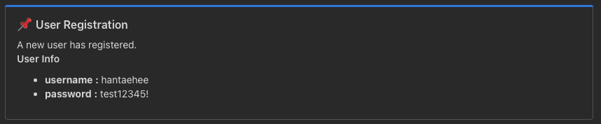

# 📣 Teams Notification for Spring Boot

> A lightweight Spring Boot library for sending Microsoft Teams messages using AOP.  
> Annotate your DTOs and methods, and this library handles the rest.

---

## ✨ Features

- ✅ AOP-based automatic message dispatch
- 🔧 Fully configurable via `application.yml`
- 🧩 Easily pluggable decorator system
- 📦 Minimal dependencies (compileOnly where possible)
- 🚀 Built for Spring Boot 3+

---

## 🛠️ Installation

### 1. Add JAR to your project

Copy the compiled `.jar` to your local `libs/` directory.

```
your-project/
    └── libs/
        └── teams-notification-1.0.0.jar
```


### 2. Register in `build.gradle`


```groovy
dependencies {
    implementation files('libs/teams-notification-1.0.0.jar')
}
```

## ⚙️ Configuration

```yaml
teams:
notification:
base-url: https://your-teams-webhook-url
teams-endpoint: /send
enabled: true
```

### Optional: Disable Teams notification
```yaml
teams:
  notification:
    enabled: false
```

## 🚀 How It Works

### 1. Annotate your DTO with `@TeamsSection` and `@MessageField`
```java
@TeamsSection(sectionTitle = "User Info")
public class UserDto {

    @MessageField(key = "Username")
    private String username;

    @MessageField(key = "Email")
    private String email;
}
```

### 2. Annotate your service method with `@TeamsEvent`
```java
@TeamsEvent(title = "📌 User Registration", message = "A new user has registered.")
public void register(UserDto dto) {
    // Your business logic here
}
```

## 🧰 Customizing Section Text Style

To customize how the key-value text appears in Teams, implement your own TeamsSectionTextFactory.

### 1. Implement the interface
```java
public class MySectionTextFactory implements TeamsSectionTextFactory {
    @Override
    public SectionText create(String key, String value) {
        return () -> "- " + key + ": _" + value + "_"; // italic value
    }
}
```

### 2. Register it as a Spring Bean
```java
@Configuration
public class CustomTeamsConfig {

    @Bean
    public TeamsSectionTextFactory sectionTextFactory() {
        return new MySectionTextFactory();
    }
}
```

When this bean is present, the default factory will be ignored thanks to `@ConditionalOnMissingBean`.

## 🧪 Example Teams Message Output


## 🧠 Advanced Notes

- Built using Spring AOP (@Around)
- Uses reflection to extract annotated fields
- Auto-configures only if teams.notification.enabled=true
- Designed to be extended easily (factories, decorators, etc.)

## 🧩 Dependencies

| Dependency              | Scope                |
|-------------------------|----------------------|
| `spring-boot-starter-aop` | Provided by user     |
| `aspectjweaver`         | Provided by user     |
| `jackson-databind`      | Included             |
| `lombok`                | Optional (compileOnly) |

> ⚠️ This library assumes **Spring Boot 3+** and **WebClient** usage.


## 📄 License
MIT License. Feel free to use, modify, and contribute.